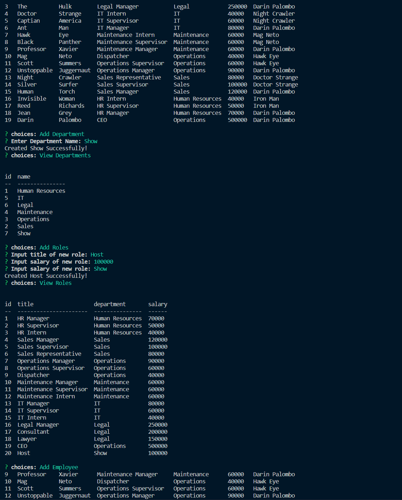

# Employee Tracker

## License:

- 
- https://opensource.org/licenses/MIT

## Table of contents:

- [License](#license)
- [Description](#description)
- [Installation](#installation)
- [Usage](#usage)
- [Contributing](#contributing)
- [Tests](#tests)
- [Questions](#questions)

## Description:

Manage employees information: Update, create, view, and delete any department, role, or employee as needed for your businesss.

## Installation:

Install NPM packages, inquirer, and mysql2.
Once these dependecies are installed run node index.js in your terminal. From that point just follow the prompts as needed.

## Usage:

Intended use of this application is to keep detailed employee records as your business grows.

## Contributors:

Darin Palombo

## Tests:

No tests needed!

## Questions:

This is too easy = NO QUESTIONS!

## Reach out to me through Github for any questions:

https://github.com/Darin1027

## Or check out the repo containing the code to the Employee Tracker

https://github.com/Darin1027/Employee-Tracker

## Or send an email if that is your preferred method of communication:

dplb1027@gmail.com

## Link to sample deployed Employee Tracker video:

https://watch.screencastify.com/v/R7KMRZIj92K1l1rmbtTZ

## Screenshots of deployed Employee Tracker:

- 

- 
